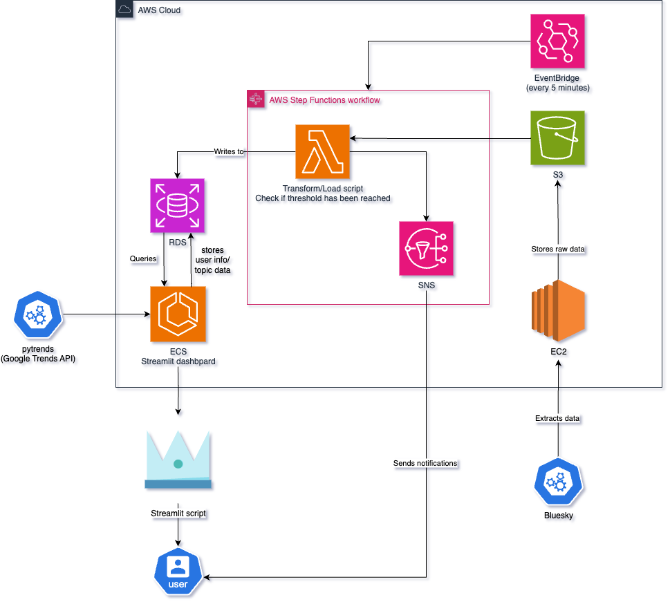
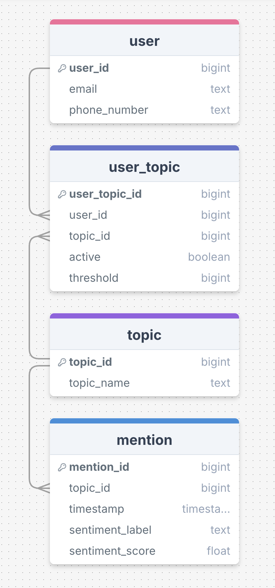

# 📈 TrendGetter

 

## Summary
In a world driven by reputation and real-time information, individuals and brands need timely insights into how topics and public opinion are evolving across the web. While platforms like Google Trends and Bluesky hold valuable data about public interest, accessing and interpreting this data requires technical expertise. As a result, most people are left relying on outdated, second-hand insights. There is a clear need for an accessible tool that empowers anyone to track, compare, and stay informed about the topics they care about — in real time.

TrendGetter is a trend monitoring and analytics tool that allows users to select topics and monitor their growth, sentiment, and related activity over time. It continuously collects data from targeted feeds, processes it, and stores results in a database, which can be explored via a live dashboard.

## Features
- Topic Tracking: Users can add topics/keywords to be tracked.
- Real-Time Monitoring: Monitors feeds for mentions of tracked topics.
- Data Storage: Stores all relevant mentions in an AWS RDS database.
- Analysis: Tracks growth and sentiment.
- Notifications: Sends alerts for spikes in activity.
- Live Dashboard: Visualises trends, comparisons, and sentiment.


## Architecture
 ### System Architecture Diagram
 

 ### Decisions
 #### Data Storage
 - The service requires the keeping of records of every message which hits one of the tracked topics, and the corresponding sentiment. 
 - Further, data is required from users about which topics they are subscribed to.
    - For this, a Postgres RDS instance is used, due to the automatic scaling and the volume of transactional queries required for the maintenance of user subscription records.
    - While the columnar queries generally used to produce visualisations are more expensive than a data-warehouse-style storage solution, we believe that the RDS will be better value overall.

 #### Extracting the data
 - To keep up with the volume of messages provided by the BlueSky firehose (around 4500/minute), a batch processing pipeline is used to extract and transform the data, slightly sacrificing the age of data in favour of performance and cost.
 - An EC2 instance stores every message posted on BlueSky and dumps the raw JSON into an S3 bucket.
 - This S3 bucket provides a cheap, unstructured data storage solution to store the unclean message data.
 - Every ten minutes, a Lambda function transforms the previous ten minutes' messages (around 45,000) into data for the RDS, ready to be visualised.

 #### Notification Service
 - Using the user data in the RDS, a step function containing the ETL Lambda function triggers another Lambda function which checks for topic thresholds set by the user. 
 - Once the threshold has been met, the user is notified via an SES.

 #### Displaying the Data and User Interface
 - A Streamlit dashboard deployed on an AWS ECS is used for the user facing aspect of TrendGetter.
 - This dashboard contains visualisations of both Google Trends data and BlueSky posts.
 - It also allows users to subscribe and unsubscribe from notifications for different topics, and request new topics to be tracked.
 - Streamlit was chosen due to the visually accessible user interfaces that can be created, as well as its integration with python code which allowed easy interaction with the rest of the architecture when required by a user action.
 - The Trendgetter website can be found on http://trend-getter.co.uk:8501/

 ## Entity Relationship Diagram
 
 - This is the ERD which represents the setup of the user/mention data in the Postgres RDS.
 - The database has been normalised to 3NF to avoid the keeping of redundant data.


Environment Variables (see below)
## Prerequisites
- Create an .env file with:
    - DB_USER=your-db-user
    - DB_PASSWORD=your-db-password
    - DB_HOST=your-db-host
    - DB_NAME=your-db-name
    - DB_PORT=the-db-port
    - DB_SCHEMA=-your-db-scchema

- You must have the following repository secrets on GitHub:
    - AWS_ACCESS_KEY_ID
    - AWS_SECRET_ACCESS_KEY
    - DB_HOST
    - DB_NAME
    - DB_PASSWORD
    - DB_PORT
    - DB_USER
    - TF_VAR_DB_PASSWORD
    - TF_VAR_DB_USERNAME
    - BLUESKY_EMAIL
    - BLUESKY_PASSWORD

Important:
Do not store your AWS access keys in .env for deployed Lambdas — use an IAM Role with the correct permissions.


## Local Development
1. Clone the repository
```git clone <github_url>```

2. Create the database schema
```cd schema_creation```
Run the schema.sql file

3. Install dependencies
```cd trend-getter
pip install -r requirements.txt```

4. Run terraform
```cd terraform
   terraform init
   terraform plan
   terraform apply```

## How the Pipeline Works
Data Collection pipeline running on ECS fetches raw mentions → uploads JSON to S3.
ETL Lambda triggers → reads latest file from S3 → transforms → writes to RDS.
Notification Lambda triggers on ETL completion → sends alerts.
Dashboard queries RDS for visualising data.


## CI/CD
- In order to smoothly develop and integrate changes to the service, a GitHub workflow is made which automatically runs test files and pylint before any merge to the main branch, only allowing the merge to go ahead if the checks passed satisfactorily. This prevents poor quality, potentially disruptive code from being added to the main branch.
- There is also a Terraform workflow implemented which stores the current state of the AWS services and automatically applies any changes merged to the main branch.


## Technology
- Python - pandas, psycopg2, pylint, pytest, altair
- AWS - RDS, EC2, ECS, ECR, S3, Step Function, Lambda Function, SES, CloudWatch,Eventbridge
- Docker
- Terraform
- PostgreSQL
- Streamlit
- CI/CD


## Contributing
PRs are welcome! Please follow PEP8 for Python code and include docstrings.
