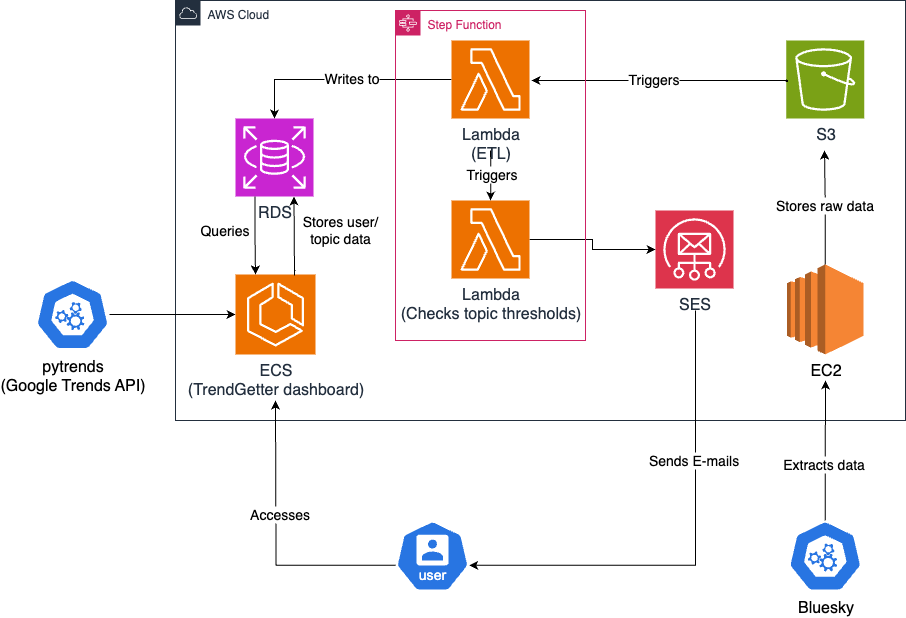

# TrendGetter Project

 
## Summary
In a world driven by reputation and real-time information, individuals and brands need timely insights into how topics and trends are evolving across the web. While platforms like Google Trends and Bluesky hold valuable data about public interest and sentiment, accessing and interpreting this data requires technical expertise. As a result, most people are left relying on outdated, second-hand insights. There is a clear need for an accessible tool that empowers anyone to track, compare, and stay informed about the topics they care about — in real time.

## Project objective
Create a tool that allows users to select topics/tags on key sites (Google Trends, BlueSky) and monitor their growth/interest over time.

## Deliverables
- Users will be able to submit topics to be tracked by the service.
- Sites/feeds will be monitored frequently for mentions of the topics and related activity, storing all relevant data in a database.
- Users will be able to access a live dashboard of topics exploring:
    - Interest/activity over time
    - Comparison of keywords/topics against one another
    - Sentiment and related terms
- Notifications for changes in activity will be sent to subscribers.

## Architecture
 ### Architecture Diagram
 
 ### Decisions
 #### Data Storage
 - For our service, we require the keeping of records of every message which hits one of our tracked topics, and the corresponding sentiment. 
 - Further, we require data on each of our users and which topics they are subscribed to.
 - For this we used a Postgres RDS instance, due to the automatic scaling and the volume of transactional queries required for the maintenance of user subscription records.
 - While the columnar queries generally used to produce visualizations are more expensive than if we had chosen a data-warehouse-style storage solution, we believe that the RDS will be better value overall.
 #### Extracting the data
 - To keep up with the volume of messages provided by the BlueSky firehose (around 4500/minute), we decided on a batch processing pipeline to extract and transform our data, slightly sacrificing the age of data we are able to provide in favour of performance and cost.
 - We have an EC2 which stores every message posted on BlueSky and dumps it into an S3 bucket.
 - This S3 bucket provides the cheap, unstructured data storage we were looking for to store our unclean message data.
 - Every ten minutes, we run a Lambda function which transforms the previous ten minutes' messages (around 45,000) into data for the RDS ready to be visualized.
 #### Notification Service
 - Using the user data in the RDS, every ten minutes, we use a step function containing our lambda function and an SNS service to notify users on activity spikes relevant to topics to which they are subscribed. 
 #### Displaying the Data and User Interface
 - For the user facing aspect of this product, we are using a streamlit dashboard.
 - This dashboard contains visualizations of both Google search data and BlueSky mentions.
 - It also allows users to control their accounts, subscribe and unsubscribe from notifications for different topics, and request new topics to be tracked.
 - We chose Streamlit due to the visually accessible user interfaces we can create through it, as well as its integration with python code which allowed us to easily interact with the rest of our architecture when required by a user action.
 ## Entity Relationship Diagram

- This is the ERD which represents the setup of the user/mention data in the Postgres RDS.
- We have set the database up in 3NF to avoid the keeping of redundant data.
## Set-up
- You must have the following repository secrets on GitHub:
    - AWS_ACCESS_KEY_ID
    - AWS_SECRET_ACCESS_KEY
    - DB_HOST
    - DB_NAME
    - DB_PASSWORD
    - DB_PORT
    - DB_USER
    - TF_VAR_DB_PASSWORD
    - TF_VAR_DB_USERNAME

## Files explained

## CI/CD
- In order to smoothly develop and integrate changes to our service, we made use of github actions.
- Firstly, we used a workflow which automatically ran test files and pylint before any merge to the main branch, only allowing the merge to go ahead if the checks passed satisfactorily. This prevented 

## Technology
- Python - pandas, psycopg2, pylint, pytest
- AWS - RDS, EC2, S3, Step Functions, Lambda
- Docker
- Terraform
- PostgreSQL
- Streamlit
- CI/CD
